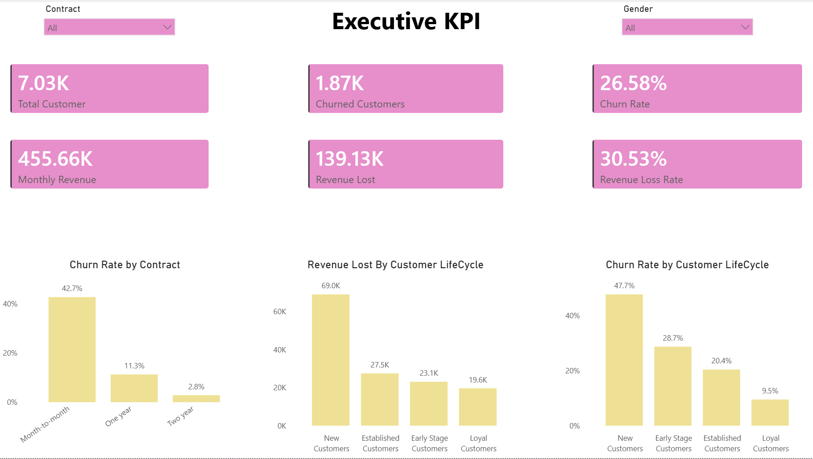
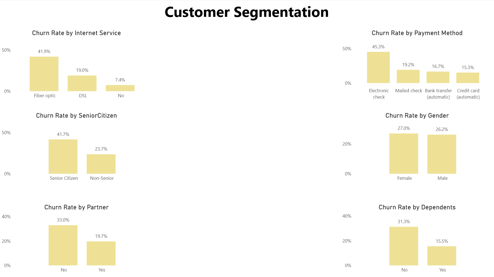
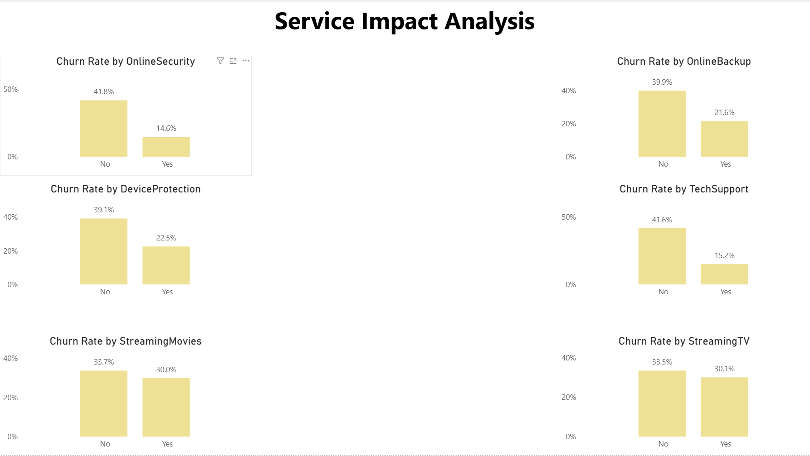
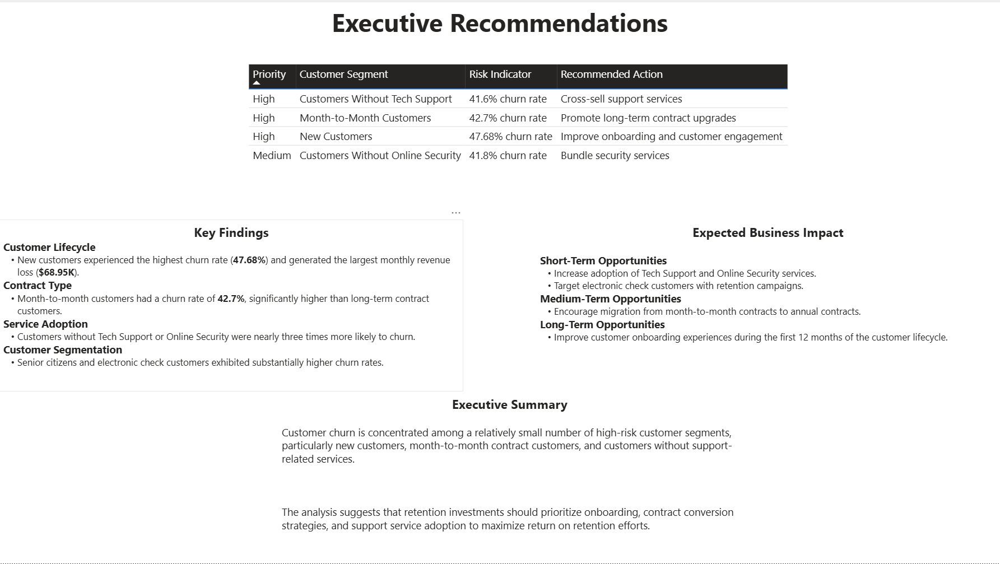

# 📉 Customer Churn Analysis

## Project Overview

This project analyzes customer churn behaviour in a telecommunications company using SQL and Power BI.

The objective is to identify the key drivers of customer attrition, quantify the business impact of churn, and provide data-driven retention strategies to improve customer loyalty and reduce revenue loss.

The analysis focuses on four key business areas:

- Customer Segmentation
- Customer Lifecycle Analysis
- Service Impact Analysis
- Revenue Impact Analysis

---

## Dataset

The project uses the IBM Telco Customer Churn dataset, which contains customer demographic information, subscription details, service usage, contract information, billing behaviour, and churn status.

The dataset includes:

- Customer demographics
- Service subscriptions
- Contract information
- Billing and payment details
- Customer tenure
- Churn outcomes

---

## Data Cleaning

The following preprocessing steps were performed before analysis:

- Removed 11 records with missing values in `TotalCharges`.
- Verified that all `customerID` values were unique.
- Converted `TotalCharges` to numeric format.
- Created customer lifecycle segments based on tenure.

Customer lifecycle groups:

```text
0–12 months  → New Customers
13–24 months → Early Stage Customers
25–48 months → Established Customers
49+ months   → Loyal Customers
```

---

## Business Questions Executed in SQL

### Customer Segmentation

- Which customer groups exhibit the highest churn rates?
- How does churn vary across internet service types?
- Does payment method influence customer retention?
- Are senior citizens more likely to churn?
- How do partners and dependents affect churn behaviour?

### Customer Lifecycle Analysis

- Which customer lifecycle stage experiences the highest churn?
- How does customer tenure influence retention?
- Which lifecycle segment contributes the largest revenue loss?

### Service Impact Analysis

- Does Online Security reduce customer churn?
- Does Tech Support improve customer retention?
- How do Online Backup and Device Protection influence churn?
- Do streaming TV and Streaming Movies improve customer retention?

### Revenue Impact Analysis

- Which customer segments generate the largest revenue loss?
- Which contract types contribute the highest revenue risk?
- Which customer groups should be prioritized for retention investments?

---


## Tools

- Excel
- SQL (MySQL)
- Power BI
- GitHub

---

## Executive KPI Dashboard



---

## Customer Segmentation Dashboard



---

## Service Impact Analysis Dashboard



---

## Executive Recommendations Dashboard



---

## Technical Approach

### SQL

SQL was used to:

- Calculate executive KPIs
- Analyze churn rates by customer segment
- Create customer lifecycle groups
- Measure service-level churn behavior
- Calculate monthly revenue loss
- Compare revenue loss across customer groups

### Power BI

Power BI was used to:

- Build interactive dashboards
- Visualize churn patterns
- Compare customer segments
- Present executive recommendations
- Support dynamic filtering through slicers

### DAX

DAX measures were created for:

- Total Customers
- Churned Customers
- Retained Customers
- Churn Rate
- Total Monthly Revenue
- Revenue Lost
- Revenue Loss Rate

---

## Project Outcome

The analysis found that customer churn is concentrated among a small number of high-risk customer segments.

The most important retention targets are:

- New customers
- Month-to-month contract customers
- Electronic check customers
- Senior citizens
- Customers without Tech Support
- Customers without Online Security

The findings suggest that improving onboarding, encouraging long-term contracts, increasing adoption of support services, and targeting high-revenue-risk segments could significantly reduce churn and improve customer retention.
